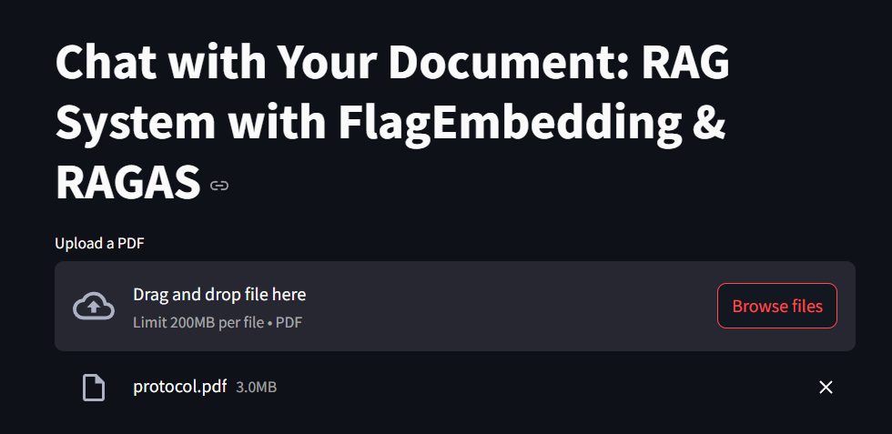
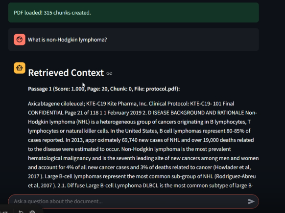
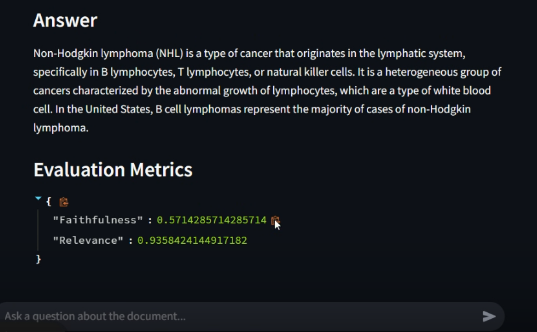

# 🧠 AdvancedRAG: Chat with Your PDF using RAG + FlagEmbedding + RAGAS

Welcome to **AdvancedRAG**, a Streamlit-based interactive app that lets you upload a PDF, ask questions about it, and receive context-aware, AI-generated answers—**backed by FAISS dense retrieval**, **FlagEmbedding reranking**, and **RAGAS-based evaluation**.

Developed by [@anweshaprakash](https://github.com/anweshaprakash) 💜

---


## 🚀 Features

- 📄 Upload **any PDF file**
- 🔍 Text is **split into chunks** with metadata
- 🔗 Dense semantic search with **FAISS**
- 🎯 Reranked using **FlagEmbedding** (BAAI/bge-reranker-large)
- 🤖 Answer generated using **GPT-3.5 / GPT-4o**
- 🧪 Evaluated using **RAGAS metrics**: Faithfulness & Relevance
- 🧼 Clean **Streamlit UI** with caching & chat history

---

## 📦 Project Structure

```
advancedrag/
├── app.py               # Streamlit app
├── requirements.txt     # Python dependencies
└── assets/
    └── demo.png         # App UI screenshot
```

---

## 🛠️ Installation

### 1. Clone the Repo

```bash
git clone https://github.com/anweshaprakash/advancedrag.git
cd advancedrag
```

### 2. Install Requirements

```bash
pip install -r requirements.txt
```

> ⚠️ Don't forget to install `faiss-cpu` or `faiss-gpu` based on your environment!

### 3. Set Environment Variables

Create a `.env` file and add your OpenAI key:

```
OPENAI_API_KEY=sk-xxxxxxxxxxxxxxxxxxxxxxxxxxxx
```

### 4. Run the App

```bash
streamlit run app.py
```

---

## 📸 Screenshots

| Upload PDF | Ask Questions | Evaluation |
|------------|----------------|------------|
|  |  |  |

---

## 🧠 Tech Stack

- [Streamlit](https://streamlit.io/)
- [FAISS](https://github.com/facebookresearch/faiss)
- [FlagEmbedding](https://huggingface.co/BAAI/bge-reranker-large)
- [LangChain](https://www.langchain.com/)
- [OpenAI](https://platform.openai.com/)
- [RAGAS](https://github.com/explodinggradients/ragas)
- [PyPDF2](https://pypi.org/project/PyPDF2/)

---

## ✅ TODOs

- [ ] Multi-document support
- [ ] GPT-4 fine-tuning
- [ ] PDF preview in UI
- [ ] Save chat history

---

## 📄 License

MIT License © [Anwesha Prakash](https://github.com/anweshaprakash)
